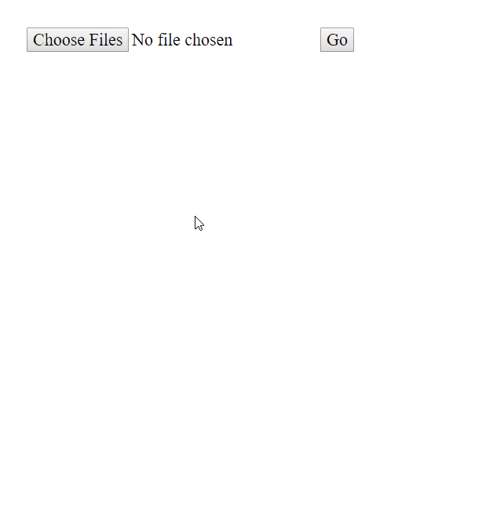

# imghost

Minimal image host



## Installation

Make sure you have [Node.js](https://nodejs.org/) installed and
[MongoDB](https://www.mongodb.com/) running.

Clone the repository

```
git clone https://github.com/travishorn/imghost.git
```

Change into the repository directory

```
cd imghost
```

Install dependencies

```
npm install
```

Start the server

```
npm start
```

## Usage

Once started, the server will be listening at http://localhost:3000

Use the web form to upload one or more image files. The files are uploaded and
you are redirected to a newly generated gallery page. Future visits to the same
URL will bring you back to the gallery.

## Configuration

By default, the server will connect to the MongoDB instance at
mongodb://localhost/imghost. You can set a different URL with the `MONGO_URL`
environment variable.

```
SET MONGO_URL=yourmongourl
```

By default, the web server will listen on port 3000. You can set a different
port with the `PORT` environment variable.

```
SET PORT=yourport
```

## License

The MIT License

Copyright 2019 Travis Horn

Permission is hereby granted, free of charge, to any person obtaining a copy of
this software and associated documentation files (the "Software"), to deal in
the Software without restriction, including without limitation the rights to
use, copy, modify, merge, publish, distribute, sublicense, and/or sell copies of
the Software, and to permit persons to whom the Software is furnished to do so,
subject to the following conditions:

The above copyright notice and this permission notice shall be included in all
copies or substantial portions of the Software.

THE SOFTWARE IS PROVIDED "AS IS", WITHOUT WARRANTY OF ANY KIND, EXPRESS OR
IMPLIED, INCLUDING BUT NOT LIMITED TO THE WARRANTIES OF MERCHANTABILITY, FITNESS
FOR A PARTICULAR PURPOSE AND NONINFRINGEMENT. IN NO EVENT SHALL THE AUTHORS OR
COPYRIGHT HOLDERS BE LIABLE FOR ANY CLAIM, DAMAGES OR OTHER LIABILITY, WHETHER
IN AN ACTION OF CONTRACT, TORT OR OTHERWISE, ARISING FROM, OUT OF OR IN
CONNECTION WITH THE SOFTWARE OR THE USE OR OTHER DEALINGS IN THE SOFTWARE.